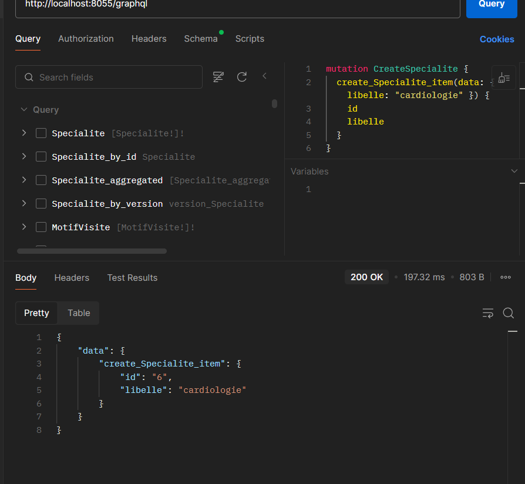
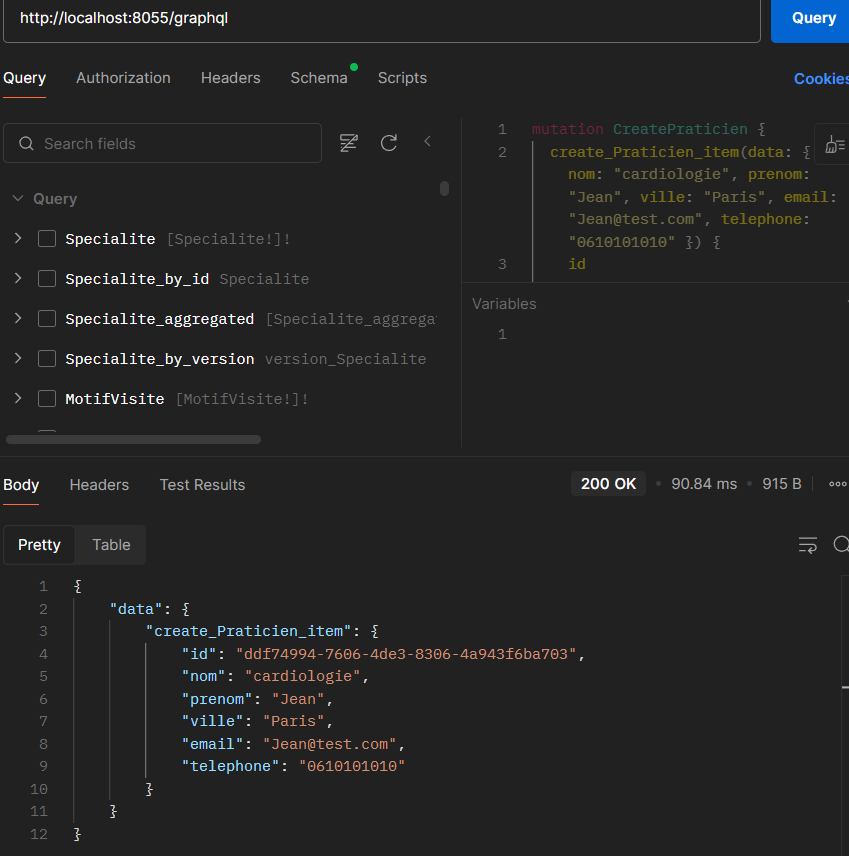
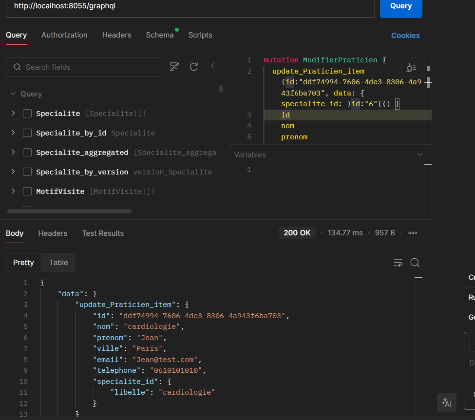
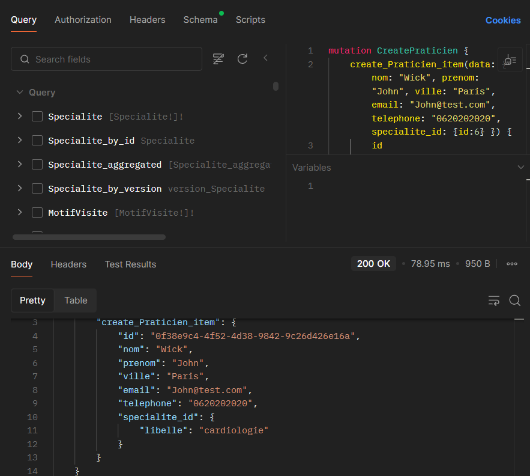
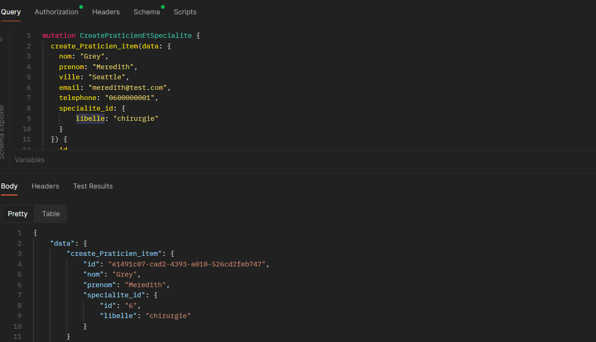
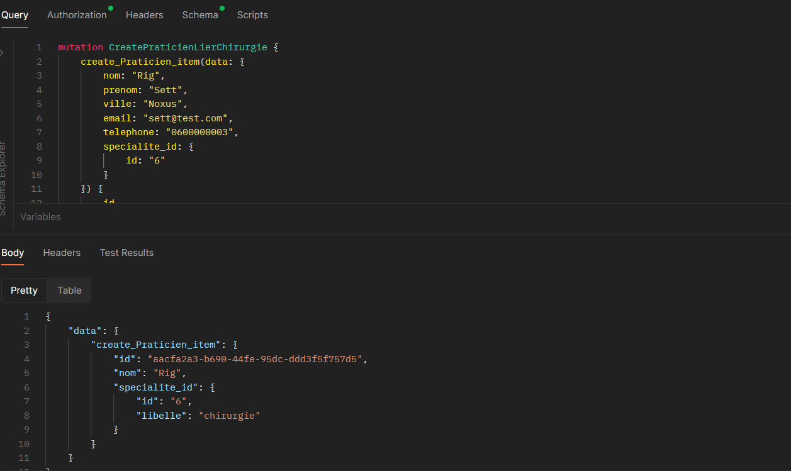
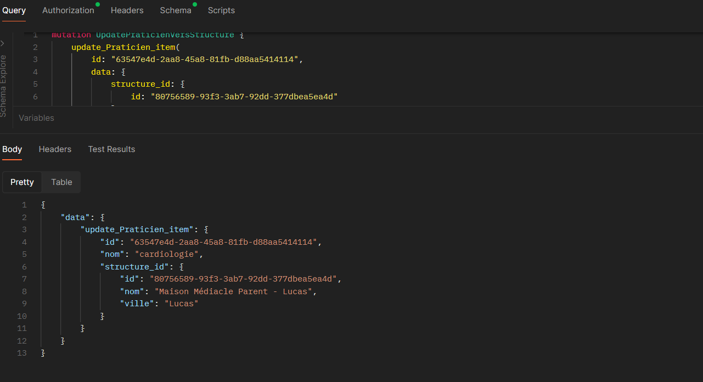
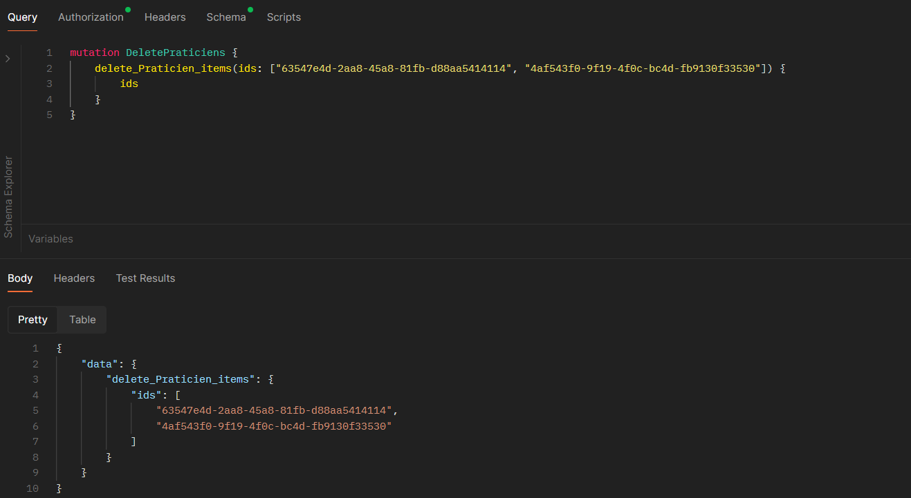

## TD GraphQL
CADET Mattéo - DIEUDONNE Quentin

## Requêtes Query
1) Liste des praticiens en précisant : id, nom, prénom, téléphone, ville  
```graphql
query {
    Praticien {
        id
        nom
        prenom
        telephone
    }
}
```


2) Idem, en ajoutant le libellé de la spécialité du praticien
```graphql
query {
    Praticien {
        id
        nom
        prenom
        telephone
        specialite_id {
            libelle
        }
    }
}
```


3) Idem, en ajoutant un filtre pour sélectionner les praticiens dont la ville  est égale à «Paris» (ou une valeur de votre jeu de données)
```graphql
query {
    Praticien (filter: { ville: {_eq : "Paris"}}) {
        id
        nom
        prenom
        telephone
        specialite_id {
            libelle
        }
    }
}
```


4) Idem, en ajoutant le nom et la ville de la structure d’appartenance du praticien,
```graphql
query {
    Praticien (filter: { ville: {_eq : "Paris"}}) {
        id
        nom
        prenom
        telephone
        specialite_id {
            libelle
        }
        structure_id {
            nom
            ville
        }
    }
}
```


5) Idem, en ajoutant un filtre pour retenir les emails contenant ".fr"
```graphql
query {
    Praticien (filter: {
            ville: { _eq: "Paris" },
            email: { _contains: ".fr" }
        }) {
        id
        nom
        prenom
        telephone
        email
        specialite_id {
            libelle
        }
        structure_id {
            nom
            ville
        }
    }
}
```


6) Lister les praticiens rattachés à une structure dont la ville est "Paris".
```graphql
query {
    Praticien (filter: { structure_id: { ville: { _eq: "Paris" } } }) {
        id
        nom
        prenom
        telephone
        structure_id {
            nom
            ville
        }
    }
}
```


7) Requête retournant une liste de praticiens installés à Paris et une liste de praticiens installés à Bourdon-les-Bains ; utiliser des alias

```graphql
query {
PraticiensParis: Praticien(filter: { ville: { _eq: "Paris" } }) {
    id
    nom
    prenom
    ville
    specialite_id {
    libelle
    }
}

    PraticiensBourdon: Praticien(filter: { ville: { _eq: "Bourdon-les-Bains" } }) {
        id
        nom
        prenom
        ville
        specialite_id {
            libelle
        }
    }
}
```


8)Transformer la requête précédente de façon à utiliser un fragment correspondant aux champs
du résultat.
```graphql
fragment champsPraticien on Praticien {
        id
        nom
        prenom
        ville
        specialite_id {
            libelle
        }
    }

query {
    PraticiensParis: Praticien(filter: { ville: {_eq: "Paris"} }){
    ...champsPraticien
    }
    PraticiensBourdon: Praticien(filter: { ville: {_eq: "Bourdon-les-Bains"} }){
    ...champsPraticien
    }
}
```


9)Transformer la requête 3 pour utiliser une variable de façon à paramétrer la requête par le
nom de la ville souhaitée.
```graphql
query Requete9($ville: String!) {
    Praticien(filter: { ville: { _eq: $ville } }) {
        id
        nom
        prenom
        telephone
        specialite_id {
            libelle
        }
    }
}
```


10) Liste des structures, en indiquant leur nom et ville,  en ajoutant la liste des praticiens attachés à chaque structure en indiquant leur nom, prénom, email ainsi que le libellé de leur spécialité.

## Autorisations dans Directus
Sur Postman, les tables MoyenPaiement et MotifVisite disparaissent du schema si on met NoAuth.

1) Lister les moyens de paiement (utilisateur utilisant un token statique)
```graphql
query MoyenPaiement {
    MoyenPaiement {
        id
        libelle
    }
}
```

Si on se met en NoAuth :


2) Lister les spécialités en indiquant les motifs de visite associés à chacune (utilisateur utilisant un token JWT)

Il faut d'abord se connecter et récupérer le token :

Ensuite on peut faire la requête en précisant le token dans Authorization.
```graphql
query {
    Specialite {
        id
        libelle
        motifs {
            id
            libelle
        }
    }
}
```


## Migrations:
1) Créer la specialité «cardiologie»

```
mutation CreateSpecialite {
  create_Specialite_item(data: { libelle: "cardiologie" }) {
    id
    libelle
  }
}
```


2) Créer un praticien: nom, prénom, ville, email, téléphone

```
mutation CreatePraticien {
  create_Praticien_item(data: { nom: "cardiologie", prenom: "Jean", ville: "Paris", email: "Jean@test.com", telephone: "0610101010" }) {
    id
    nom
    prenom
    ville
    email
    telephone
  }
}
```

3) Modifier le praticien pour le rattacher à la spécialité «cardiologie»

```
mutation ModifierPraticien {
  update_Praticien_item(id:"ddf74994-7606-4de3-8306-4a943f6ba703", data: { specialite_id: {id:"6"}}) {
    id
    nom
    prenom
    ville
    email
    telephone
    specialite_id{
        libelle
    }
  }
}
```


4) Créer un praticien en le rattachant à la spécialité «cardiologie»
```
mutation CreatePraticien {
    create_Praticien_item(data: { nom: "Wick", prenom: "John", ville: "Paris", email: "John@test.com", telephone: "0620202020", specialite_id: {id:6} }) {
        id
        nom
        prenom
        ville
        email
        telephone
        specialite_id{
            libelle
        }
    }
}
```


5) Créer un praticien et créer en même temps sa spécialité «chirurgie»
```graphql
mutation CreatePraticienEtSpecialite {
    create_Praticien_item(data: {
        nom: "Grey",
        prenom: "Meredith",
        ville: "Seattle",
        email: "meredith@test.com",
        telephone: "0600000001",
        specialite_id: {
            libelle: "chirurgie"
        }
    }) {
        id
        nom
        prenom
        specialite_id {
            id
            libelle
        }
    }
} 
```


6) Ajouter un praticien à la spécialité «chirurgie»
```graphql
```


7) Modifier le premier praticien créé pour le rattacher à une structure existante
```graphql
```


8) Supprimer les deux derniers praticiens créés.
```graphql
```
